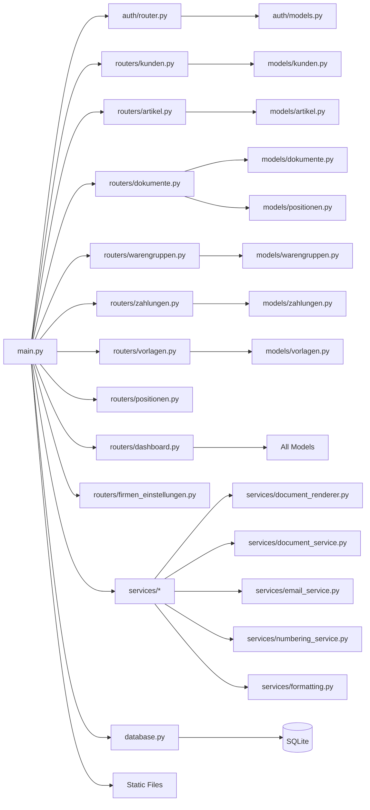
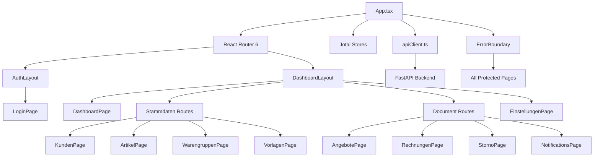
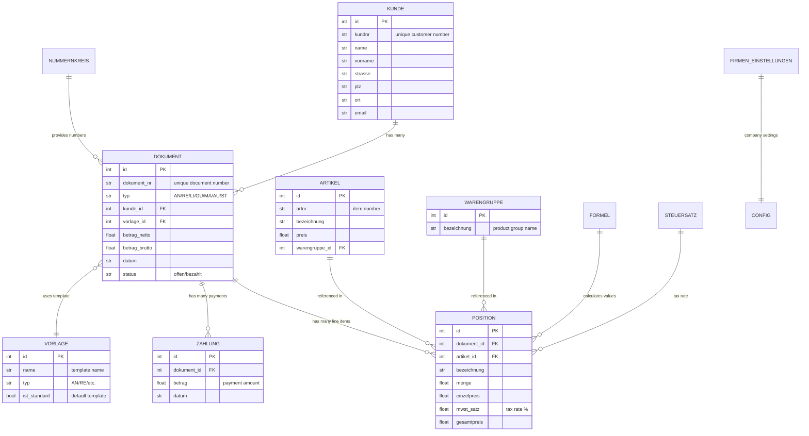
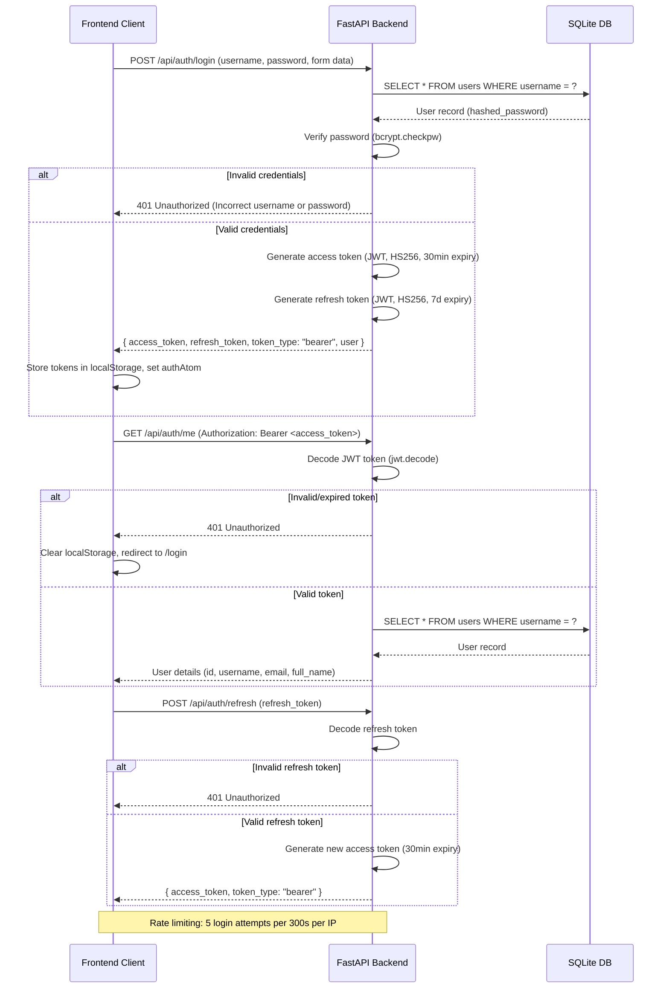

<!-- refreshed: 2026-05-05 -->
# Architecture

**Analysis Date:** 2026-05-05

## System Overview

GSWin ERP is a custom invoicing CRM/ERP system designed for German Handwerker (tradespeople). It follows a modern web architecture with a React/Vite frontend, FastAPI/SQLModel backend, and SQLite database.

```mermaid
graph TD
    Client[Browser / Mobile Client] -->|HTTPS| Nginx[Nginx Reverse Proxy<br/>:80]
    Nginx -->|/api/*| Backend[FastAPI Backend<br/>:8000 (prod)<br/>:8001 (staging)]
    Nginx -->|/*| Frontend[React Frontend<br/>:5173 (prod)<br/>:5175 (staging)]
    Backend -->|SQLModel| DB[(SQLite Database<br/>gswin_modern.db)]
    Backend -->|Static Files| Static[Static Files<br/>/static/uploads]
    Frontend -->|/api/*| Nginx
    Backend -->|JWT Auth| Auth[JWT Authentication]
    Frontend -->|Axios| APIClient[apiClient.ts]
    APIClient -->|Bearer Token| Backend
```

## Component Responsibilities

| Component | Responsibility | File/Directory |
|-----------|----------------|---------------|
| FastAPI Backend | Core API logic, routing, auth, business logic | `backend/app/` |
| React Frontend | User interface, routing, state management | `frontend/src/` |
| SQLite Database | Persistent storage for all entities | `data/gswin_modern.db` |
| Nginx | Reverse proxy, static file serving, SSL termination | `deploy/nginx/` |
| JWT Auth | User authentication, token management | `backend/app/auth/` |
| Document Renderer | PDF generation for invoices/quotes | `backend/app/services/document_renderer.py` |
| TanStack Query | Frontend data fetching/caching | `frontend/src/api/` |

## Pattern Overview

**Overall:** Layered architecture with clear separation between API routes, business logic services, and data models. The frontend uses a component-based architecture with protected routes and state management via Jotai.

**Key Characteristics:**
- **Backend:** SQLModel (ORM) with FastAPI for REST API, JWT for auth, service layer for business logic
- **Frontend:** React 18 with TypeScript, Vite build tool, React Router 6 for routing, Jotai for state, TanStack for data/table
- **Deployment:** Docker Compose with multi-stage builds, Nginx reverse proxy, environment-specific configs
- **Database:** SQLite with WAL mode enabled, SQLModel metadata auto-creation, performance indexes

## Layers

### Backend Layer
- **Purpose:** Handle HTTP requests, business logic, data persistence
- **Location:** `backend/app/`
- **Contains:** Routers (API endpoints), Services (business logic), Models (data schema), Auth (JWT handling)
- **Depends on:** SQLModel (ORM), FastAPI framework, SQLite database
- **Used by:** React frontend via REST API

### Frontend Layer
- **Purpose:** User interface, client-side routing, state management
- **Location:** `frontend/src/`
- **Contains:** Pages (route components), Components (reusable UI), API client, Stores (Jotai), Hooks
- **Depends on:** React, React Router, Axios, TanStack Query
- **Used by:** End users via browser

### Database Layer
- **Purpose:** Persistent storage of all application data
- **Location:** `data/gswin_modern.db` (SQLite)
- **Contains:** Tables for customers, items, documents, payments, positions, etc.
- **Depends on:** SQLModel ORM, SQLite engine
- **Used by:** Backend via SQLModel sessions

## Data Flow

### Primary Request Path (Document Creation)
1. User creates document in React frontend (`frontend/src/pages/documents/QuoteCreationPage.tsx`)
2. Frontend sends POST request to `/api/dokumente` with Bearer token (`apiClient.ts` interceptor adds token)
3. Backend `dokumente.router` handles request, validates token via `auth/router.py` dependency
4. Backend calls `document_service.py` to create document with positions
5. SQLModel session writes to `dokumente` and `dokument_positionen` tables
6. Backend returns created document JSON to frontend
7. Frontend updates TanStack Query cache and redirects to document detail page

### Authentication Flow (see dedicated section below for sequence diagram)
1. User submits login form with username/password
2. Frontend sends POST `/api/auth/login` with form data
3. Backend verifies credentials against `users` table, generates JWT access+refresh tokens
4. Frontend stores tokens in localStorage, sets auth state via Jotai `authAtom`
5. Subsequent requests include Bearer token in Authorization header

**State Management:**
- Frontend: Jotai atoms for auth state, TanStack Query for server state, React Hook Form for form state
- Backend: SQLModel sessions for request-scoped database state, in-memory rate limit tracker for login attempts

## Key Abstractions

### SQLModel Entities
- **Purpose:** Define database schema and API request/response models
- **Examples:** `backend/app/models/kunden.py` (Kunde), `backend/app/models/dokumente.py` (Dokument)
- **Pattern:** Base model → Table model → Create/Read/Update variants using SQLModel inheritance

### FastAPI Routers
- **Purpose:** Group related API endpoints with prefix and tags
- **Examples:** `backend/app/routers/kunden.py` (customer endpoints), `backend/app/routers/dokumente.py` (document endpoints)
- **Pattern:** Router instances with dependency injection for database sessions and auth

### React Page Components
- **Purpose:** Top-level route components for each feature area
- **Examples:** `frontend/src/pages/dashboard/DashboardPage.tsx`, `frontend/src/pages/documents/AngebotePage.tsx`
- **Pattern:** Page components wrapped in ErrorBoundary, use TanStack Query for data fetching

## Entry Points

### Backend Entry Point
- **Location:** `backend/app/main.py`
- **Triggers:** Uvicorn server starts with `app.main:app` (ASGI app)
- **Responsibilities:** Initialize FastAPI app, configure CORS, mount static files, include all routers, run DB init

### Frontend Entry Point
- **Location:** `frontend/src/main.tsx`
- **Triggers:** Vite dev server or built static files served by Nginx
- **Responsibilities:** Render React app with Router, inject global styles

### Request Entry Points
- **API:** `https://peters-erp.com/api/*` (proxied by Nginx to backend :8000)
- **Frontend:** `https://peters-erp.com/*` (proxied by Nginx to frontend :5173)
- **Auth:** `https://peters-erp.com/api/auth/*` (login, refresh, me endpoints)

## Architectural Constraints

- **Threading:** Python backend uses single-threaded ASGI (Uvicorn) but SQLite with WAL mode allows concurrent reads
- **Global state:** Backend has in-memory `login_attempts` dict for rate limiting (non-persistent across restarts)
- **Circular imports:** Avoided by importing models inside functions (e.g., `init_db()` imports all models)
- **Frontend routing:** All protected routes wrapped in `ProtectedRoute` component checking Jotai auth state
- **Database:** SQLite file-based, single file `gswin_modern.db`, not suitable for high-concurrency writes

## Anti-Patterns

### In-Memory Rate Limiting
**What happens:** Login attempt tracking stored in Python dict, lost on restart
**Why it's wrong:** Rate limits reset on backend restart, no persistence across container recreation
**Do this instead:** Use Redis or SQLite table for rate limit storage (see `backend/app/auth/router.py` lines 27-29)

### Duplicate Health Check Endpoints
**What happens:** Two identical `/api/health` endpoints in `main.py` (lines 148-154 and 156-163)
**Why it's wrong:** Redundant code, potential confusion
**Do this instead:** Remove duplicate endpoint, keep single health check (see `backend/app/main.py`)

## Error Handling

**Strategy:** HTTP exceptions via FastAPI's `HTTPException`, frontend error boundaries via React ErrorBoundary component.

**Patterns:**
- **Backend:** Raise `HTTPException` with status code and detail, return standardized error responses
- **Frontend:** `ErrorBoundary` component wraps all protected routes, API client interceptor handles 401 by redirecting to login
- **Auth errors:** 401 for invalid credentials/tokens, 429 for rate-limited login attempts

## Cross-Cutting Concerns

**Logging:** Backend uses Python `print()` for startup messages, configurable `LOG_LEVEL` env var (debug/info)
**Validation:** Backend uses SQLModel/Pydantic for request validation, frontend uses Zod via React Hook Form resolvers
**Authentication:** JWT Bearer tokens, access token 30min expiry, refresh token 7 days, stored in localStorage
**CORS:** Configured via `CORS_ORIGINS` env var, defaults for local dev, hardened for production
**Static Files:** Backend serves uploads via `/static` mount, Nginx proxies to backend for production

---

## Backend Architecture



### Backend Structure Details
- **Routers (`backend/app/routers/`):** 9 routers covering all major entities:
  - `kunden.py`: Customer CRUD endpoints
  - `artikel.py`: Item/product CRUD endpoints
  - `dokumente.py`: Document (invoice/quote) CRUD, PDF generation
  - `warengruppen.py`: Product group management
  - `zahlungen.py`: Payment tracking
  - `vorlagen.py`: Document template management
  - `positionen.py`: Line item management
  - `dashboard.py`: Dashboard summary data
  - `firmen_einstellungen.py`: Company settings
- **Services (`backend/app/services/`):**
  - `document_renderer.py`: Generates PDF documents using WeasyPrint/Jinja2
  - `document_service.py`: Business logic for document creation/updates
  - `email_service.py`: Sends invoice emails to customers
  - `numbering_service.py`: Auto-generates document numbers via Nummernkreise
  - `formatting.py`: Currency/date formatting helpers
  - `date_correction.py`: Date parsing utilities
- **Models (`backend/app/models/`):** 13 model files with SQLModel table/request/response variants
- **Auth (`backend/app/auth/`):** JWT login, refresh, user registration, rate limiting

---

## Frontend Architecture



### Frontend Structure Details
- **Pages (`frontend/src/pages/`):** Feature-based page components:
  - `auth/`: Login page
  - `dashboard/`: Dashboard with summary widgets
  - `customers/`, `stammdaten/kunden/`: Customer management
  - `products/`, `stammdaten/artikel/`: Item/product management
  - `documents/`: Angebote (quotes), Rechnungen (invoices), Storno (cancellations)
  - `settings/`: Company settings, template management
  - `templates/`: Legacy template editor
- **Components (`frontend/src/components/`):** Reusable UI components:
  - `auth/`: ProtectedRoute component
  - `documents/`: Document-specific components (PDF viewer, status badges)
  - `form/`: Form field components
  - `layout/`: DashboardLayout, AuthLayout
  - `search/`: Global search component
  - `table/`: TanStack React Table wrappers
  - `ui/`: Base UI components (ErrorBoundary, buttons, modals)
- **API Layer (`frontend/src/api/`):**
  - `apiClient.ts`: Axios instance with interceptors for auth headers and 401 handling
  - `authService.ts`: Auth-specific API calls
  - `warengruppenService.ts`: Product group API calls
- **State Management (`frontend/src/stores/`):** Jotai atoms for auth state (`authStore.ts`)
- **Routing (`frontend/src/App.tsx`):** React Router 6 with protected routes, redirects based on auth state

---

## Database Schema



### Database Details
- **Engine:** SQLite 3 with WAL mode enabled for better concurrency
- **ORM:** SQLModel (built on Pydantic and SQLAlchemy core)
- **Tables:** 13 core tables (kunden, artikel, dokumente, dokument_positionen, zahlungen, vorlagen, warengruppen, nummernkreise, steuersaetze, formeln, firmen_einstellungen, users, dokument_templates)
- **Indexes:** Performance indexes on frequent query paths (document type+date, customer name, etc.) created in `database.py`
- **File Location:** `data/gswin_modern.db` (dev), `/opt/peters-erp/data/production/` (prod), `/opt/peters-erp/data/staging/` (staging)

---

## Deployment Architecture

```mermaid
graph TD
    subgraph Production [Production Environment]
        Nginx[nginx:80] --> FrontendProd[frontend:5173]
        Nginx --> BackendProd[backend:8000]
        FrontendProd -->|image| FrontendImage[ghcr.io/weareuntitled/peters-erp/frontend:latest]
        BackendProd -->|image| BackendImage[ghcr.io/weareuntitled/peters-erp/backend:latest]
        BackendProd --> DBProd[(SQLite /data/production/gswin_modern.db)]
        BackendProd --> StaticProd[/static /opt/peters-erp/static]
        Nginx -->|server_name peters-erp.com| Public[Public Internet]
    end
    
    subgraph Staging [Staging Environment]
        NginxStaging[nginx:80] --> FrontendStaging[frontend:5175]
        NginxStaging --> BackendStaging[backend:8001]
        FrontendStaging -->|image| FrontendImage
        BackendStaging -->|image| BackendImage
        BackendStaging --> DBStaging[(SQLite /data/staging/gswin_modern.db)]
        BackendStaging --> StaticStaging[/static]
        NginxStaging -->|server_name staging.peters-erp.com| Public
    end
    
    subgraph Development [Development Environment]
        FrontendDev[frontend:5174 vite dev]
        BackendDev[backend:8000 uvicorn --reload]
        FrontendDev --> BackendDev
        BackendDev --> DBDev[(SQLite ./data/gswin_modern.db)]
        FrontendDev -->|hot reload| DevBrowser[Browser]
    end
    
    CI[GitHub Actions] -->|build/push| GHCR[ghcr.io Registry]
    GHCR -->|pull| Production
    GHCR -->|pull| Staging
```

### Deployment Details
- **Containers:** 2 core containers (backend, frontend) per environment, Nginx runs on host (not containerized)
- **Images:** Pre-built images pushed to GitHub Container Registry (ghcr.io/weareuntitled/peters-erp/*)
- **Environment Configs:**
  - Production: `/opt/peters-erp/.env.production` (CORS origins set to https://peters-erp.com)
  - Staging: `/opt/peters-erp/.env.staging` (CORS origins include dev ports)
  - Development: `backend/.env.local`, `frontend/.env.local`
- **Health Checks:** Backend has `/api/health` endpoint, Docker checks via curl every 30s
- **Restart Policy:** All containers use `restart: unless-stopped`
- **Volumes:**
  - Backend: `/opt/peters-erp/data/` (SQLite DB), `/opt/peters-erp/static/` (uploads)
  - Frontend: None (stateless, served by Nginx)

---

## Authentication Flow



### Authentication Details
- **JWT Configuration:** HS256 algorithm, secret from `SECRET_KEY` env var (auto-generated if missing)
- **Token Expiry:** Access token 30 minutes (configurable via `ACCESS_TOKEN_EXPIRE_MINUTES`), refresh token 7 days (configurable via `REFRESH_TOKEN_EXPIRE_DAYS`)
- **Password Hashing:** bcrypt with salt (handled in `auth/models.py`, `auth/router.py`)
- **Rate Limiting:** In-memory tracker (5 attempts per IP per 300 seconds) in `auth/router.py`
- **Frontend Storage:** Tokens stored in `localStorage`, attached via Axios interceptor in `apiClient.ts`
- **Protected Routes:** Frontend `ProtectedRoute` component checks Jotai `authAtom` for user state

---

## Tech Stack Summary

### Languages
**Primary:**
- Python 3.x - Backend logic, FastAPI, SQLModel
- TypeScript 4.9.0 - Frontend logic, type safety

**Secondary:**
- HTML/CSS - Frontend markup and styling
- SQL (SQLite) - Database queries (abstracted via SQLModel)

### Runtime
**Environment:**
- Python 3.x (Backend)
- Node.js (Frontend build/dev)

**Package Manager:**
- pip (Backend) - `requirements.txt`
- npm (Frontend) - `package.json`
- Lockfile: `package-lock.json` (frontend), no lockfile for backend (uses fixed versions in requirements.txt)

### Frameworks
**Core:**
- FastAPI 0.104.1 - Backend REST API framework
- React 18.2.0 - Frontend UI framework

**Frontend:**
- Vite 4.1.0 - Build tool, dev server
- React Router DOM 6.8.0 - Client-side routing
- TanStack React Query 4.24.0 - Data fetching/caching
- TanStack React Table 8.7.0 - Table components
- React Hook Form 7.43.0 - Form handling
- Jotai 2.0.0 - State management
- Tailwind CSS 3.2.0 - Styling
- Heroicons React 2.0.0 - Icon set
- Headless UI React 1.7.19 - Accessible UI components

**Backend:**
- SQLModel 0.0.14 - ORM (Pydantic + SQLAlchemy)
- Uvicorn 0.24.0 - ASGI server
- PyJWT 2.8.0 - JWT encoding/decoding
- bcrypt 4.0.1 - Password hashing
- WeasyPrint 59.0 - PDF generation
- Jinja2 3.1.2 - Template engine for documents

**Build/Dev:**
- TypeScript 4.9.0 - Type checking
- PostCSS 8.4.0 + Autoprefixer 10.4.0 - CSS processing
- Vitest 0.28.0 - Frontend testing

### Configuration
**Environment:**
- Backend: `.env.local` (dev), `/opt/peters-erp/.env.production` (prod), `/opt/peters-erp/.env.staging` (staging)
- Frontend: `.env.local` (dev), Vite injects `VITE_API_URL` at build time
- Key vars: `SECRET_KEY`, `DATABASE_URL`, `CORS_ORIGINS`, `GSWIN_ADMIN_USER`, `GSWIN_ADMIN_PASS`

**Build:**
- Frontend: `vite.config.ts` with React plugin, Tailwind config
- Backend: `Dockerfile` with Python base, installs requirements.txt
- Docker: `docker-compose.yml` (dev), `docker-compose.staging.yml`, `docker-compose.production.yml`

### Platform Requirements
**Development:**
- Python 3.x, Node.js 18+, npm, Docker Desktop (optional for containerized dev)

**Production:**
- Linux server (Ubuntu/Debian), Docker, Nginx, SSL certificate (for HTTPS via Let's Encrypt)
- GitHub Container Registry access for pulling images

---

*Architecture analysis: 2026-05-05*
